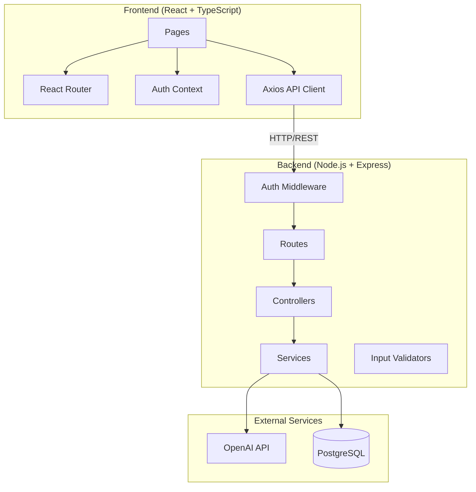
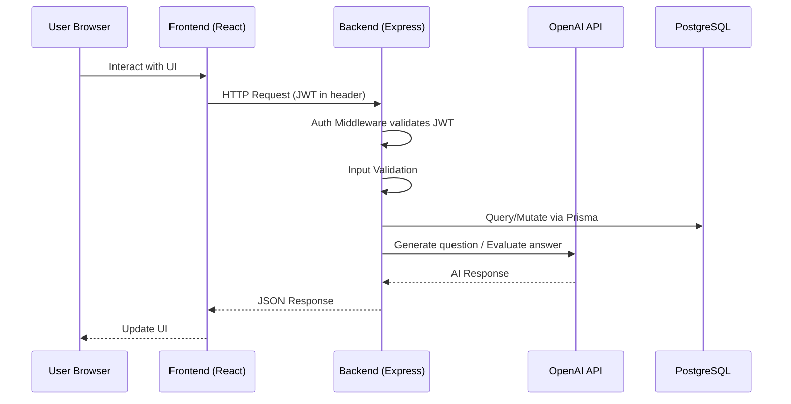
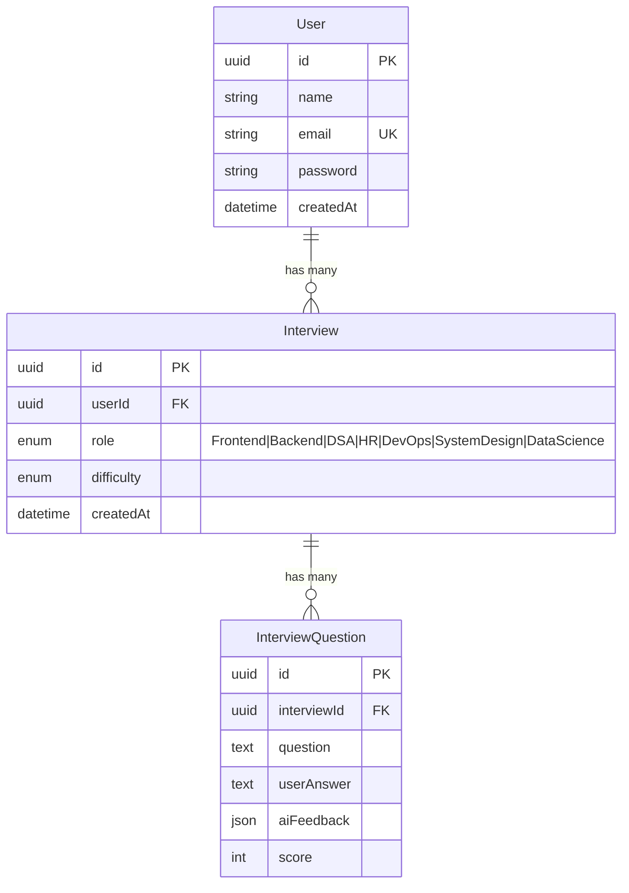
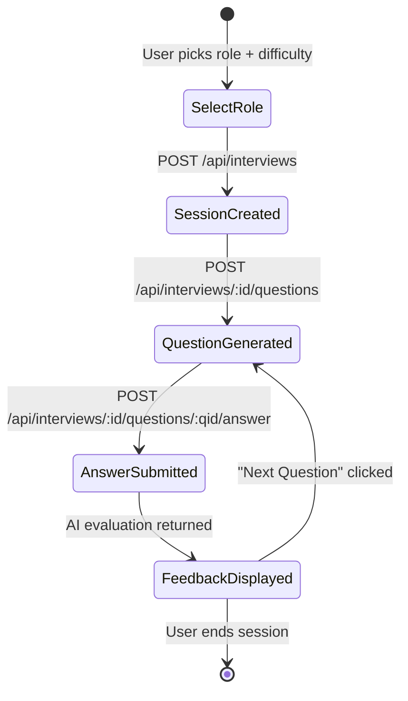

# Design Document: HireMind AI

## Overview

HireMind AI is a full-stack SaaS platform for AI-powered mock interview practice. Users register, select a role and difficulty, and receive AI-generated interview questions. The AI evaluates answers in real-time, providing scores and structured feedback. A dashboard tracks performance over time, a history view lets users revisit past sessions, and an optional resume analyzer provides AI-driven resume feedback.

The system follows a client-server architecture with a React/TypeScript SPA frontend communicating via REST API with a Node.js/Express backend. The backend uses MVC layering (Routes → Controllers → Services), PostgreSQL via Prisma ORM for persistence, and the OpenAI API for all AI capabilities (question generation, answer evaluation, resume analysis).

## Architecture

### High-Level Architecture Diagram



### Request Flow



### Project Structure

```
hiremind-ai/
├── client/                     # Frontend
│   ├── src/
│   │   ├── api/                # Axios instance and API call functions
│   │   ├── components/         # Reusable UI components
│   │   ├── context/            # Auth context provider
│   │   ├── pages/              # Route-level page components
│   │   ├── types/              # TypeScript interfaces
│   │   ├── App.tsx             # Router setup
│   │   └── main.tsx            # Entry point
│   ├── .env.example
│   └── package.json
├── server/                     # Backend
│   ├── src/
│   │   ├── controllers/        # Request handlers
│   │   ├── services/           # Business logic
│   │   ├── routes/             # Express route definitions
│   │   ├── middleware/         # Auth middleware, error handler
│   │   ├── validators/         # Input validation schemas
│   │   ├── config/             # Environment config loader
│   │   ├── types/              # TypeScript interfaces
│   │   └── app.ts              # Express app setup
│   ├── prisma/
│   │   └── schema.prisma       # Database schema
│   ├── .env.example
│   └── package.json
└── README.md
```

## Components and Interfaces

### Backend Components

#### 1. Auth Module

| Layer | File | Responsibility |
|-------|------|----------------|
| Route | `auth.routes.ts` | `POST /api/auth/register`, `POST /api/auth/login` |
| Controller | `auth.controller.ts` | Parse request, call service, return response |
| Service | `auth.service.ts` | Hash passwords (bcrypt), verify credentials, generate JWT |
| Validator | `auth.validator.ts` | Validate name/email/password fields |

**Key Interfaces:**

```typescript
// Register request body
interface RegisterInput {
  name: string;       // non-empty
  email: string;      // valid email format
  password: string;   // minimum 6 characters
}

// Login request body
interface LoginInput {
  email: string;
  password: string;
}

// Auth response
interface AuthResponse {
  token: string;
  user: {
    id: string;
    name: string;
    email: string;
    createdAt: Date;
  };
}
```

#### 2. Interview Module

| Layer | File | Responsibility |
|-------|------|----------------|
| Route | `interview.routes.ts` | `POST /api/interviews`, `GET /api/interviews/:id`, `POST /api/interviews/:id/questions`, `POST /api/interviews/:id/questions/:qid/answer` |
| Controller | `interview.controller.ts` | Parse request, call service, return response |
| Service | `interview.service.ts` | Create sessions, manage question flow, persist answers and feedback |
| Validator | `interview.validator.ts` | Validate role, difficulty, answer text |

**Key Interfaces:**

```typescript
type Role = 'Frontend' | 'Backend' | 'DSA' | 'HR' | 'DevOps' | 'SystemDesign' | 'DataScience';
type Difficulty = 'Easy' | 'Medium' | 'Hard';

interface CreateInterviewInput {
  role: Role;
  difficulty: Difficulty;
}

interface SubmitAnswerInput {
  answer: string;  // non-empty
}

interface QuestionResponse {
  id: string;
  interviewId: string;
  question: string;
}

interface EvaluationResponse {
  id: string;
  question: string;
  userAnswer: string;
  score: number;          // 1-10
  aiFeedback: {
    strengths: string[];
    weaknesses: string[];
    improvements: string[];
  };
}
```

#### 3. AI Service

| File | Responsibility |
|------|----------------|
| `ai.service.ts` | Wraps OpenAI API calls for question generation, answer evaluation, and resume analysis |

**Key Interfaces:**

```typescript
interface AIQuestionResult {
  question: string;
}

interface AIEvaluationResult {
  score: number;           // 1-10
  strengths: string[];
  weaknesses: string[];
  improvements: string[];
}

interface AIResumeResult {
  strengths: string[];
  weaknesses: string[];
  missing_skills: string[];
  suggestions: string[];
}
```

**Design Decision:** The AI service is a single module rather than three separate ones because all three operations (question generation, answer evaluation, resume analysis) share the same OpenAI client configuration and error handling patterns. Each operation is a separate method on the service.

#### 4. Dashboard Module

| Layer | File | Responsibility |
|-------|------|----------------|
| Route | `dashboard.routes.ts` | `GET /api/dashboard` |
| Controller | `dashboard.controller.ts` | Parse request, call service, return response |
| Service | `dashboard.service.ts` | Aggregate metrics from Interview and InterviewQuestion tables |

**Key Interfaces:**

```typescript
interface DashboardResponse {
  totalSessions: number;
  averageScore: number;
  recentSessions: {
    id: string;
    role: Role;
    difficulty: Difficulty;
    createdAt: Date;
  }[];
  scoreOverTime: {
    date: string;       // ISO date string
    averageScore: number;
  }[];
}
```

#### 5. History Module

| Layer | File | Responsibility |
|-------|------|----------------|
| Route | `history.routes.ts` | `GET /api/interviews` (paginated), `GET /api/interviews/:id` (with questions) |
| Controller | Shared with interview controller | Reuses interview controller for detail view |
| Service | `interview.service.ts` | Paginated list query, detail query with questions |

**Note:** History shares the interview routes and service. The `GET /api/interviews` endpoint supports pagination via `page` and `limit` query parameters.

#### 6. Resume Analyzer Module

| Layer | File | Responsibility |
|-------|------|----------------|
| Route | `resume.routes.ts` | `POST /api/resume/analyze` |
| Controller | `resume.controller.ts` | Handle file upload, call service, return response |
| Service | `resume.service.ts` | Extract PDF text, call AI service for feedback |
| Middleware | `upload.middleware.ts` | Multer config for PDF-only uploads |

**Key Interfaces:**

```typescript
interface ResumeAnalysisResponse {
  strengths: string[];
  weaknesses: string[];
  missing_skills: string[];
  suggestions: string[];
}
```

#### 7. Middleware

| File | Responsibility |
|------|----------------|
| `auth.middleware.ts` | Verify JWT from Authorization header, attach user to request |
| `error.middleware.ts` | Global error handler returning consistent `{ status, message }` JSON |
| `upload.middleware.ts` | Multer configuration for PDF file uploads |

#### 8. Config

| File | Responsibility |
|------|----------------|
| `config/index.ts` | Load and validate environment variables at startup; crash if required vars are missing |

**Required Environment Variables:**
- `DATABASE_URL` — PostgreSQL connection string
- `JWT_SECRET` — Secret for signing JWT tokens
- `JWT_EXPIRES_IN` — Token expiration (e.g., "7d")
- `OPENAI_API_KEY` — OpenAI API key
- `PORT` — Server port (default: 5000)

### Frontend Components

#### Pages

| Page | Route | Description |
|------|-------|-------------|
| `LoginPage` | `/login` | Email/password form, link to signup |
| `SignupPage` | `/signup` | Name/email/password form, link to login |
| `DashboardPage` | `/dashboard` | Metrics cards, score chart, recent sessions |
| `StartInterviewPage` | `/interview/start` | Role and difficulty selection |
| `InterviewSessionPage` | `/interview/:id` | Question display, answer input, feedback cards |
| `HistoryPage` | `/history` | Paginated list of past sessions with expandable details |
| `ResumeAnalyzerPage` | `/resume` | PDF upload, feedback display |

#### Shared Components

| Component | Purpose |
|-----------|---------|
| `ProtectedRoute` | Wraps routes requiring auth; redirects to `/login` if no token |
| `Navbar` | Navigation bar with links and logout button |
| `LoadingSpinner` | Reusable spinner for async operations |
| `Toast` | Toast notification component for success/error messages |
| `ScoreIndicator` | Color-coded score display (red < 4, yellow 4-7, green > 7) |
| `FeedbackCard` | Card displaying strengths/weaknesses/improvements |

#### Auth Context

```typescript
interface AuthContextType {
  user: User | null;
  token: string | null;
  login: (token: string, user: User) => void;
  logout: () => void;
  isAuthenticated: boolean;
}
```

The Auth context stores the JWT in `localStorage`, provides it to the Axios interceptor for automatic header injection, and exposes `login`/`logout` methods consumed by auth pages and the Navbar.

#### API Client

A single Axios instance configured with:
- Base URL from environment variable (`VITE_API_URL`)
- Request interceptor that attaches `Authorization: Bearer <token>` header
- Response interceptor that triggers logout on 401 responses

### API Endpoints Summary

| Method | Endpoint | Auth | Description |
|--------|----------|------|-------------|
| POST | `/api/auth/register` | No | Register new user |
| POST | `/api/auth/login` | No | Login user |
| POST | `/api/interviews` | Yes | Create interview session |
| GET | `/api/interviews` | Yes | List user's interviews (paginated) |
| GET | `/api/interviews/:id` | Yes | Get interview with questions |
| POST | `/api/interviews/:id/questions` | Yes | Generate next question |
| POST | `/api/interviews/:id/questions/:qid/answer` | Yes | Submit answer, get evaluation |
| GET | `/api/dashboard` | Yes | Get dashboard metrics |
| POST | `/api/resume/analyze` | Yes | Upload PDF, get feedback |

## Data Models

### Prisma Schema

```prisma
generator client {
  provider = "prisma-client-js"
}

datasource db {
  provider = "postgresql"
  url      = env("DATABASE_URL")
}

enum Role {
  Frontend
  Backend
  DSA
  HR
  DevOps
  SystemDesign
  DataScience
}

enum Difficulty {
  Easy
  Medium
  Hard
}

model User {
  id         String      @id @default(uuid())
  name       String
  email      String      @unique
  password   String
  createdAt  DateTime    @default(now())
  interviews Interview[]
}

model Interview {
  id         String              @id @default(uuid())
  userId     String
  role       Role
  difficulty Difficulty
  createdAt  DateTime            @default(now())
  user       User                @relation(fields: [userId], references: [id])
  questions  InterviewQuestion[]

  @@index([userId])
}

model InterviewQuestion {
  id          String    @id @default(uuid())
  interviewId String
  question    String
  userAnswer  String?
  aiFeedback  Json?
  score       Int?
  interview   Interview @relation(fields: [interviewId], references: [id])

  @@index([interviewId])
}
```

### Entity Relationship Diagram



### Data Flow: Interview Session Lifecycle




## Correctness Properties

*A property is a characteristic or behavior that should hold true across all valid executions of a system — essentially, a formal statement about what the system should do. Properties serve as the bridge between human-readable specifications and machine-verifiable correctness guarantees.*

### Property 1: Registration creates a valid user with hashed password

*For any* valid registration input (non-empty name, valid email, password ≥ 6 chars), the Auth_Service should create a User record where the stored password is a bcrypt hash that does not equal the plaintext input, the id is a valid UUID, and createdAt is a valid timestamp.

**Validates: Requirements 1.1, 1.4**

### Property 2: Duplicate email registration is rejected

*For any* email that already exists in the database, attempting to register a new user with that email should return a 409 Conflict error, and no new User record should be created.

**Validates: Requirements 1.2**

### Property 3: Invalid registration input is rejected

*For any* registration input where name is empty, email is not a valid email format, or password is fewer than 6 characters, the Auth_Service should return a 400 Bad Request error and no User record should be created.

**Validates: Requirements 1.3**

### Property 4: Successful auth returns JWT and user without password

*For any* successful registration or login, the response should contain a non-empty JWT string and a user object with id, name, email, and createdAt fields, and the user object should not contain a password field.

**Validates: Requirements 1.5, 2.1**

### Property 5: Invalid credentials return generic 401

*For any* login attempt where the email does not exist or the password is incorrect, the Auth_Service should return a 401 Unauthorized error with the message "Invalid credentials", without revealing whether the email or password was wrong.

**Validates: Requirements 2.2, 2.3**

### Property 6: JWT expiration matches configuration

*For any* JWT generated by the Auth_Service, the token's expiration claim should match the configured `JWT_EXPIRES_IN` environment variable value.

**Validates: Requirements 2.4**

### Property 7: Valid JWT grants access through middleware

*For any* valid, non-expired JWT token included in the Authorization header, the auth middleware should allow the request to proceed and attach the correct user identity (id, email) to the request context.

**Validates: Requirements 3.1**

### Property 8: Invalid or missing JWT is rejected by middleware

*For any* request to a protected endpoint that includes an expired JWT, a malformed JWT, or no JWT at all, the auth middleware should return a 401 Unauthorized error.

**Validates: Requirements 3.2, 3.3**

### Property 9: Protected route redirect without token

*For any* protected frontend route (Dashboard, Interview, History, Resume), accessing it without a valid token in storage should redirect the user to the Login page.

**Validates: Requirements 4.4**

### Property 10: Interview session creation with valid input

*For any* valid Role (Frontend, Backend, DSA, HR, DevOps, SystemDesign, DataScience) and Difficulty (Easy, Medium, Hard) combination submitted by an authenticated user, the Interview_Service should create an Interview record with a valid UUID, the correct userId, the selected role and difficulty, and a createdAt timestamp, and return the session ID.

**Validates: Requirements 5.2, 5.3**

### Property 11: Invalid role or difficulty is rejected

*For any* string value that is not one of the valid Role or Difficulty enum values, the Interview_Service should return a 400 Bad Request error and no Interview record should be created.

**Validates: Requirements 5.4**

### Property 12: AI prompt format for question generation

*For any* Role and Difficulty combination, the prompt sent to the OpenAI API should match the format "Generate a {difficulty} level {role} interview question." where {difficulty} and {role} are the selected values.

**Validates: Requirements 6.2**

### Property 13: AI question response parsing

*For any* valid OpenAI API response to a question generation request, the AI_Service should parse it into a structured object containing a non-empty question string.

**Validates: Requirements 6.3**

### Property 14: Generated question is persisted and linked

*For any* successfully generated question, the Interview_Service should create an InterviewQuestion record linked to the correct Interview_Session, containing the generated question text, with userAnswer, aiFeedback, and score initially null.

**Validates: Requirements 6.5**

### Property 15: AI evaluation response parsing and validation

*For any* valid OpenAI API evaluation response, the AI_Service should parse it into a structured object with score (integer 1-10), strengths (array of strings), weaknesses (array of strings), and improvements (array of strings). If the score is outside 1-10, the service should reject the evaluation.

**Validates: Requirements 7.2, 7.5**

### Property 16: Answer submission updates question record

*For any* submitted answer to an InterviewQuestion, after successful AI evaluation, the InterviewQuestion record should be updated with the userAnswer text, the aiFeedback JSON, and the score integer, and all three fields should be non-null.

**Validates: Requirements 7.3**

### Property 17: Dashboard metrics correctness

*For any* user with interview data, the Dashboard_Service should return: (a) totalSessions equal to the count of that user's Interview records, (b) averageScore equal to the arithmetic mean of all their scored InterviewQuestion records, (c) recentSessions containing at most 5 sessions ordered by createdAt descending, and (d) scoreOverTime data where each date's average matches the actual scores for that date.

**Validates: Requirements 9.1, 9.2, 9.3, 9.4**

### Property 18: Interview history pagination and ordering

*For any* user and any valid page/limit parameters, the Interview_Service should return a list of that user's Interview_Sessions where: the list length is at most `limit`, sessions are ordered by createdAt descending, and all returned sessions belong to the authenticated user.

**Validates: Requirements 10.1**

### Property 19: Interview session detail includes all questions

*For any* Interview_Session, requesting its detail should return all InterviewQuestion records associated with that session, each including question, userAnswer, aiFeedback, and score fields.

**Validates: Requirements 10.2**

### Property 20: Non-PDF file upload is rejected

*For any* uploaded file that is not a valid PDF (wrong MIME type or extension), the Resume_Analyzer should return a 400 Bad Request error with a descriptive message, and no analysis should be performed.

**Validates: Requirements 11.6**

### Property 21: Resume feedback response parsing

*For any* valid OpenAI API response to a resume analysis request, the Resume_Analyzer should parse it into a structured object with strengths (array of strings), weaknesses (array of strings), missing_skills (array of strings), and suggestions (array of strings).

**Validates: Requirements 11.4**

### Property 22: Global error handler returns consistent JSON

*For any* unhandled error thrown during request processing, the global error handling middleware should catch it and return a JSON response with a numeric `status` code and a string `message` field, never exposing stack traces or internal details.

**Validates: Requirements 12.2**

### Property 23: Relational integrity across entities

*For any* User with multiple Interviews, and any Interview with multiple InterviewQuestions, querying the parent entity and including its children should return exactly the children that were created for that parent, with no cross-contamination between users or sessions.

**Validates: Requirements 13.4, 13.5**

## Error Handling

### Backend Error Strategy

All errors flow through a centralized error handling pipeline:

1. **Input Validation Errors (400):** Caught at the validator layer before reaching the controller. Return field-specific error messages.

2. **Authentication Errors (401):** Thrown by auth middleware for missing, expired, or invalid JWT tokens. Login failures also return 401 with a generic "Invalid credentials" message to prevent user enumeration.

3. **Conflict Errors (409):** Thrown by the auth service when a duplicate email is detected during registration.

4. **AI Service Errors (503):** Thrown when the OpenAI API is unreachable or returns an error. The AI service wraps all OpenAI calls in try-catch and translates failures to 503 with a user-friendly message.

5. **Internal Errors (500):** Thrown when AI returns invalid data (e.g., score outside 1-10). Also the fallback for any unhandled exception caught by the global error middleware.

### Error Response Format

All error responses follow a consistent structure:

```json
{
  "status": 400,
  "message": "Descriptive error message"
}
```

For validation errors, the message includes field-specific details:

```json
{
  "status": 400,
  "message": "Validation failed",
  "errors": [
    { "field": "email", "message": "Invalid email format" }
  ]
}
```

### Frontend Error Handling

- **Axios Response Interceptor:** Catches 401 responses globally and triggers logout + redirect to login.
- **Toast Notifications:** API errors trigger toast messages with user-friendly text. Network errors show a generic "Connection error" message.
- **Per-Component Error State:** Each page/component manages its own error state for displaying inline error messages when appropriate.
- **Loading States:** All async operations show loading indicators. Errors clear the loading state and display the error message.

### OpenAI API Resilience

- All OpenAI calls are wrapped in try-catch blocks.
- Timeout configuration on the OpenAI client to prevent hanging requests.
- Structured response parsing with validation — if the AI returns malformed JSON or out-of-range values, the service throws an internal error rather than passing bad data through.

## Testing Strategy

### Dual Testing Approach

The testing strategy uses both unit tests and property-based tests for comprehensive coverage:

- **Unit tests** verify specific examples, edge cases, integration points, and error conditions
- **Property-based tests** verify universal properties across randomly generated inputs

Both are complementary — unit tests catch concrete bugs with known inputs, property tests verify general correctness across the input space.

### Property-Based Testing Configuration

- **Library:** [fast-check](https://github.com/dubzzz/fast-check) for TypeScript
- **Minimum iterations:** 100 per property test
- **Each property test must reference its design document property with a tag comment:**
  ```
  // Feature: hiremind-ai, Property {number}: {property_text}
  ```
- **Each correctness property is implemented by a single property-based test**

### Test Categories

#### Backend Unit Tests

| Area | What to Test |
|------|-------------|
| Auth Service | Registration with valid input creates user (example), login with correct credentials returns token (example), duplicate email returns 409 (example) |
| Auth Middleware | Valid token passes (example), expired token returns 401 (example), missing token returns 401 (example) |
| Interview Service | Create session returns ID (example), generate question creates record (example), submit answer updates record (example) |
| AI Service | Mock OpenAI success responses (example), mock OpenAI error responses (example), malformed response handling (example) |
| Dashboard Service | Metrics with no data returns zeros (edge case), metrics with data returns correct values (example) |
| Resume Analyzer | PDF text extraction (example), non-PDF rejection (example) |
| Error Middleware | Unhandled error returns consistent JSON (example) |
| Config | Missing env var terminates process (example) |
| Validators | Valid inputs pass (example), invalid inputs rejected with correct messages (example) |

#### Backend Property Tests

| Property | What to Generate |
|----------|-----------------|
| Property 1 | Random valid name/email/password combinations |
| Property 2 | Random emails, register twice with same email |
| Property 3 | Random invalid inputs (empty names, bad emails, short passwords) |
| Property 4 | Random valid credentials for register and login |
| Property 5 | Random non-existent emails and wrong passwords |
| Property 7 | Random valid JWTs with different user payloads |
| Property 8 | Random malformed strings, expired tokens, empty strings |
| Property 10 | All valid Role × Difficulty combinations with random users |
| Property 11 | Random strings not in the Role/Difficulty enums |
| Property 12 | All Role × Difficulty combinations |
| Property 15 | Random OpenAI-like evaluation responses with various scores |
| Property 17 | Random users with random numbers of interviews and scores |
| Property 18 | Random users with varying interview counts, random page/limit values |
| Property 22 | Random error types thrown during request processing |
| Property 23 | Random users with random interview/question hierarchies |

#### Frontend Unit Tests

| Area | What to Test |
|------|-------------|
| Auth Context | Login stores token, logout clears token, isAuthenticated reflects state |
| ProtectedRoute | Redirects to login without token, renders children with token |
| Login/Signup Pages | Renders correct form fields, submits form, handles errors |
| Interview Flow | Renders question, submits answer, shows feedback, next question button |
| Dashboard | Renders metrics cards, renders chart, handles loading state |
| History | Renders session list, expands session to show questions |
| Resume Analyzer | Renders upload input, accepts PDF only, displays feedback sections |
| API Client | Attaches auth header, handles 401 with logout |

#### Frontend Property Tests

| Property | What to Generate |
|----------|-----------------|
| Property 9 | Random protected route paths |

### Test Tooling

| Tool | Purpose |
|------|---------|
| Vitest | Test runner for both frontend and backend |
| fast-check | Property-based testing library |
| @testing-library/react | Frontend component testing |
| supertest | Backend HTTP endpoint testing |
| msw (Mock Service Worker) | Mock OpenAI API responses in tests |
